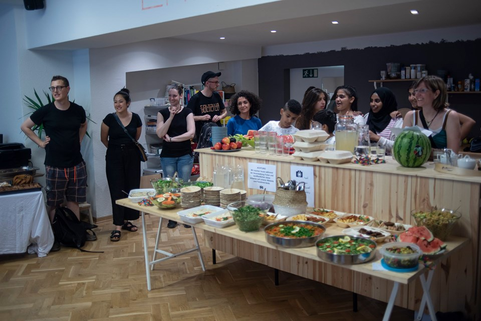
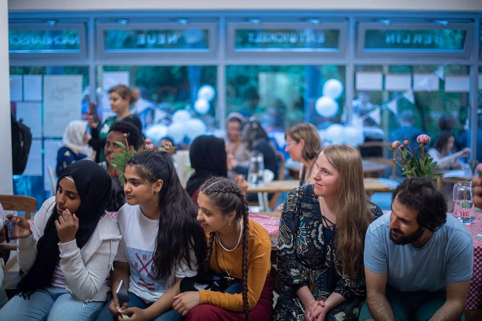
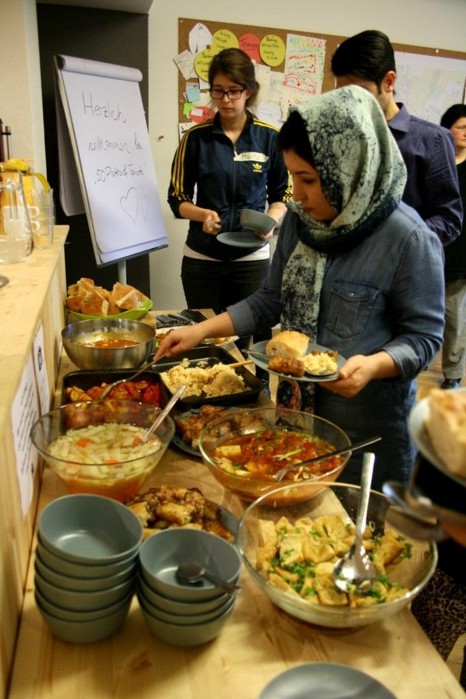

## BENN Alt-Hohenschönhausen

## Offen
Kommen Sie gern während der Sprechzeiten vorbei! 
Unsere Sprechzeiten sind: 
Dienstag von 14-18 Uhr
Mittwoch von 10-12 Uhr 
Donnerstag nach Vereinbarung
Freitag von 10-14 Uhr

## Aktivitäten
Begegnungsangebote für die Nachbarschaft (Programm siehe Webseite), Verweisberatung, Orientierung im Kiez, Flotte-Standort, Sprachfrühstück mit Frauentreff Zwischenraum

## Links
<a class="external_link" href="http://www.benn-alt-hsh.de">Webseite</a> 
<a class="external_link" href="http://www.facebook.com/BENNHSHNORD">Facebook</a>

## Zielgruppe
Neue und alteingesessene Nachbar*innen aus dem Kiez 

## Kontakt
[benn@alt-hsh.de](mailto:benn@alt-hsh.de) 
<a href="tel:+493050958872">030 50958872</a> 

## Wo

## Eindrücke

  
  
  
  

