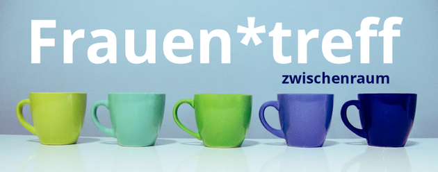

## Begegnungen

  <label class="youthclub" onclick="javascript:window.open('BENN_HSH.html', '_self')">
     BENN Hsh Nord - Auf gute Nachbarschaft
  </label>
  <label class="youthclub" onclick="javascript:window.open('/Begegnungen/Buergertreff.html', '_self')">
     Bürgertreff - Gemeinsam im Kiez leben
  </label>
   <label class="youthclub" onclick="javascript:window.open('Frauentreff.html', '_self')">
     Frauentreff Zwischenraum
   </label>
  <label class="youthclub" onclick="javascript:window.open('HVWgarten.html', '_self')">
     Gemeinschaftsgarten Falkenberg
  </label>
  <label class="youthclub" onclick="javascript:window.open('/Begegnungen/GutePol.html', '_self')">
     Gute Pol - Stadtteilkoordination
  </label>
  <label class="youthclub" onclick="javascript:window.open('/Begegnungen/Kieztreff.html', '_self')">
     Kieztreff Lebensnetz
  </label>
  <label class="youthclub" onclick="javascript:window.open('/Begegnungen/WieckerStr.html', '_self')">
     Nachbarschaftsgarten Wiecker Str.
  </label>
   <label class="youthclub" onclick="javascript:window.open('OCB_Integration.html', '_self')">
     OCB Integrationsarbeit
  </label>
  <label class="youthclub" onclick="javascript:window.open('Oskar.html', '_self')">
     Oskar Freiwilligenagentur
  </label>
  <label class="youthclub" onclick="javascript:window.open('SchuleFrieden.html', '_self')">
     Schule des Friedens
  </label>
  <label class="youthclub" onclick="javascript:window.open('SPIK_Integration.html', '_self')">
     SPIK integrative Kinder- & Jugendarbeit
  </label>
