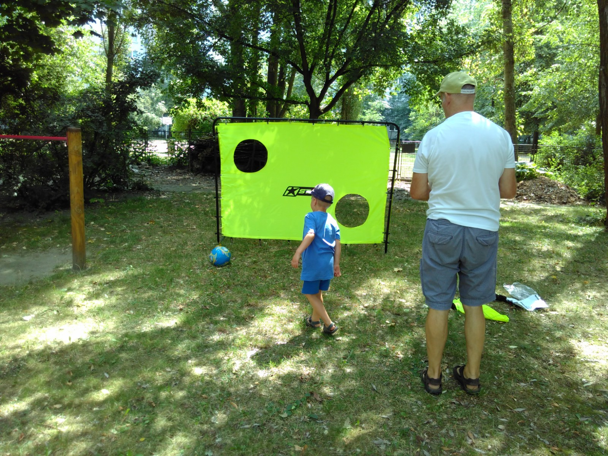
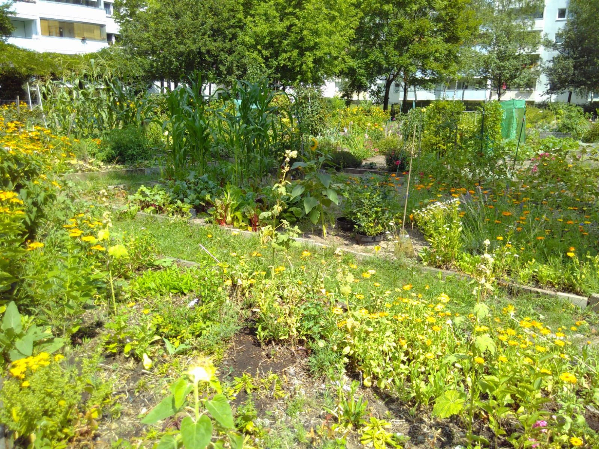
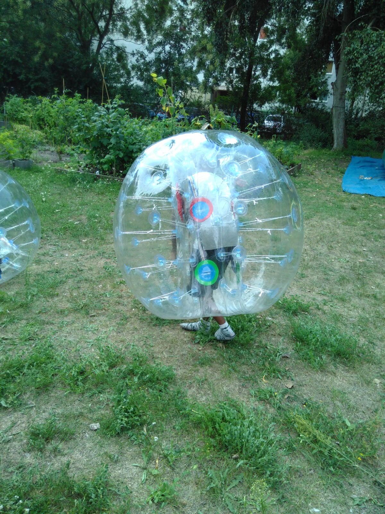
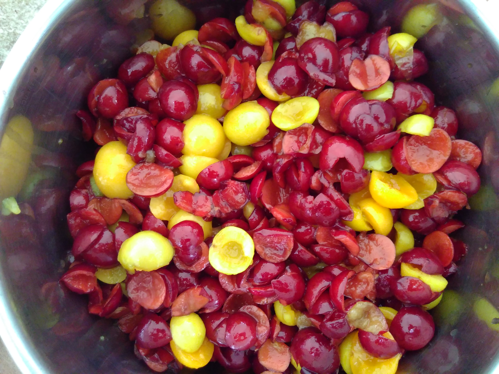

## Nachbarschaftsgarten Wiecker Straße

## Offen
wir bitten um Voranmeldung

## Aktivitäten

gemeinschaftlich gärtnern, stricken, Marmelade kochen, malen im Grünen 

## Regelmäßige Angebote
Monatliche Gemeinschaftsaktivitäten

## Zielgruppe
6 - 99 Jahre, bis 16 Jahre in Begleitung der Eltern

## Kontakt
[Sabine-Rosemann@alice-dsl.de](mailto:Sabine-Rosemann@alice-dsl.de) 

## Wo

## Eindrücke

  
  
  
  

