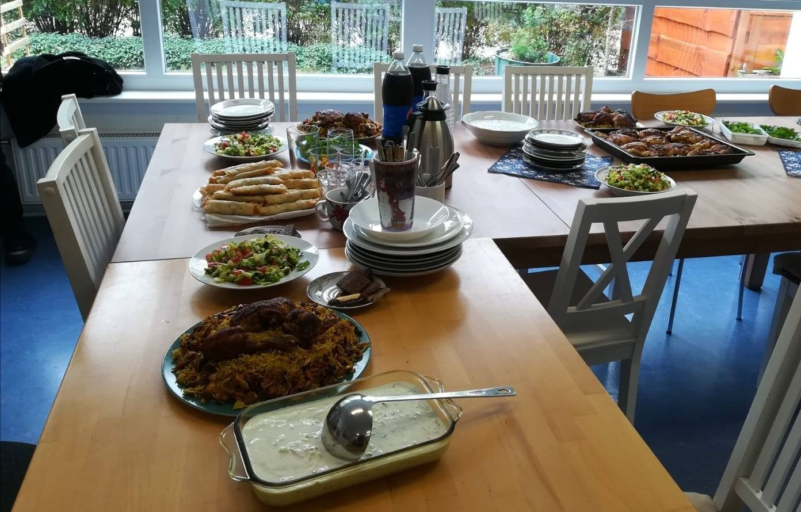

## Willkommensprojekte beim VaV

## Offen
Angebote im Nachbarschaftshaus & mobil unterwegs bzw. bei BENN Hsh

## Aktivitäten

Montags 14 bis 15.30 Uhr: Frauenyoga mit Kinderbetreuung (gefördert durch BENN Hsh) 
Jeder zweite Montag 14 Uhr: Ich koche was, das du nicht kennst 
Jeder zweite Donnerstag 14 Uhr: Frauencafé  

## Links
<a target="_blank" href="http://www.vav-hhausen.de/Stadtteilarbeit/Willkommenskultur/willkommen-start.html">Webseite</a> 

## Zielgruppe
Willkommen sind alle!

## Kontakt
[Martina.Hellmich@vav-hhausen.de](mailto:Martina.Hellmich@vav-hhausen.de) 
[L.Biermann@vav-hhausen.de](mailto:L.Biermann@vav-hhausen.de) 
<a href="tel:+49 3096277147"> 030 9627 7147</a> 

## Wo
Im Nachbarschaftshaus des Ostseeviertels

