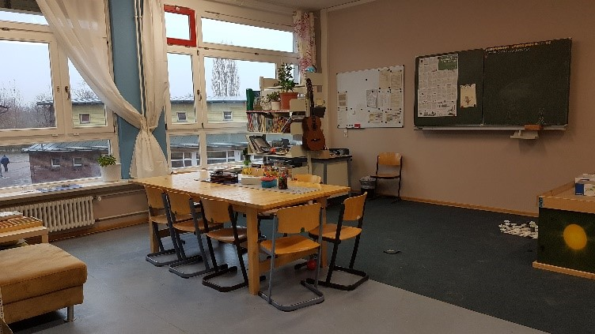
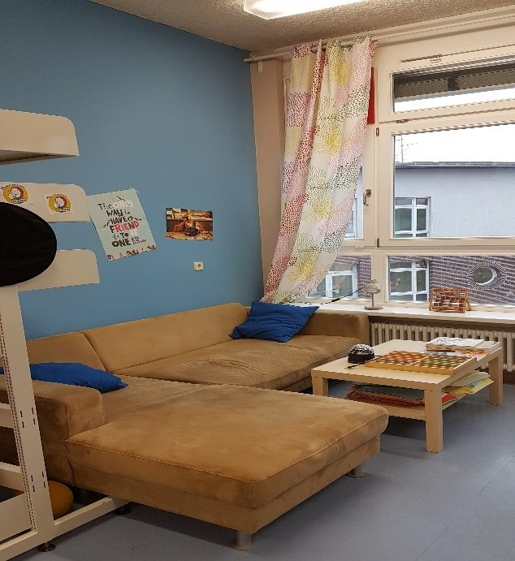

## Schulstation an der Feldmark Grundschule

|||
-:|:-
**Adresse** |     Wartiner Str.23, 13057 Berlin-Hohenschönhausen
**Offen** |       Mo–Fr 8.30-14.30Uhr
**Alter** |       Grundschulkinder und deren Erziehungsberechtigte
**Kontakt** |     [schulstation.feldmark@spikev.de](mailto:schulstation.feldmark@spikev.de) <a href="tel:+4915783520782">0157 8352 0782</a>
**Webseite** |    <a target="_blank" href="http://www.spikev.de/schulbezogene-angebote-fuer-schueler-eltern-lehrer-und-erzieher/schulhilfe/">Website</a>
**Angebote** |    Soziales Lernen, Konfliktlotsenausbildung, soziales Kunstprojekt, kontinuierliche Kontakt & Beratungsangebote für Kinder, Erziehungsberechtigte und LehrerInnen, Entspannung für die Kinder
**Institution** | Sozialpädagogische Arbeit im Kiez/SPIK e.V.

## Fotos

  
  

