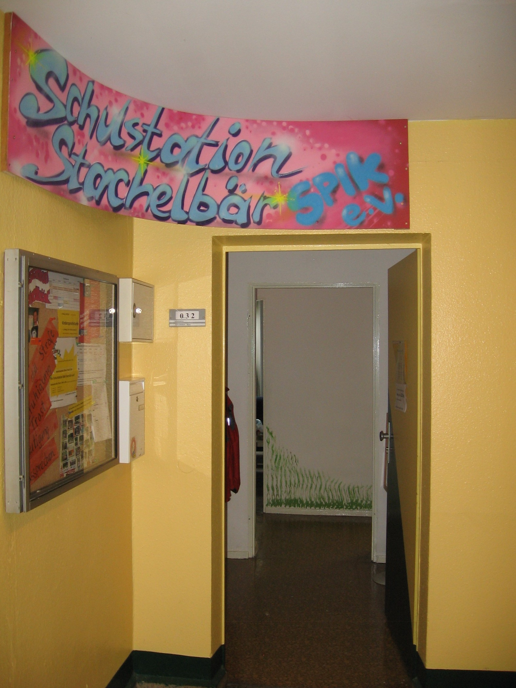
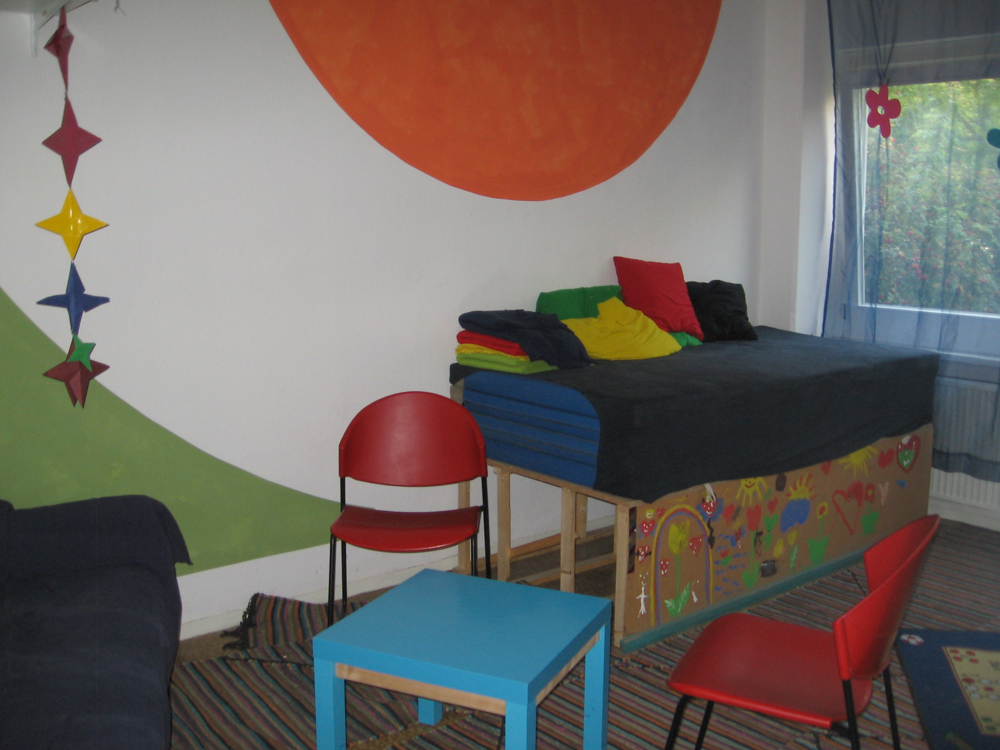

## Schulstation Stachelbär

## Offen
Mo-Do: 08.00 - 15.30 Uhr

Fr: 08:00 - 13.30 Uhr

## Angebote
für SchülerInnen 
für Eltern 
für LehrerInnen & ErzieherInnen 
Entlastung und Unterstützung im Schulalltag, „Auszeit“, Soziales Lernen, Gewaltprävention, Schülerzeitung, Vermittlung bei Konflikten, Gruppen- & Einzelarbeit, Beratung, Elterncafes, erlebnispädagogisches Ferienangebot 
Konfliktlotsenausbildung, Schülerrat/ SchülervertreterInnen stärken, Klassenrat, Erlebniscamp im Sommer

## Links
<a class="external_link" href="http://www.spikev.de/schulbezogene-angebote-fuer-schueler-eltern-lehrer-und-erzieher/neue-seite/">Website</a>

## Zielgruppe
SchülerInnen der Schule am Wäldchen 1.-6. Klasse, deren Eltern, Kollegen der Schule (Lehrende & Erziehende)

## Wo

## Kontakt
[schulstation.stachelbaer@spikev.de](mailto:schulstation.stachelbaer@spikev.de) 
<a href="tel:+493091205931">030 912 05931</a> 
AnsprechpartnerIn: Jana Zander, David Blank

## Eindrücke

  
  
  

