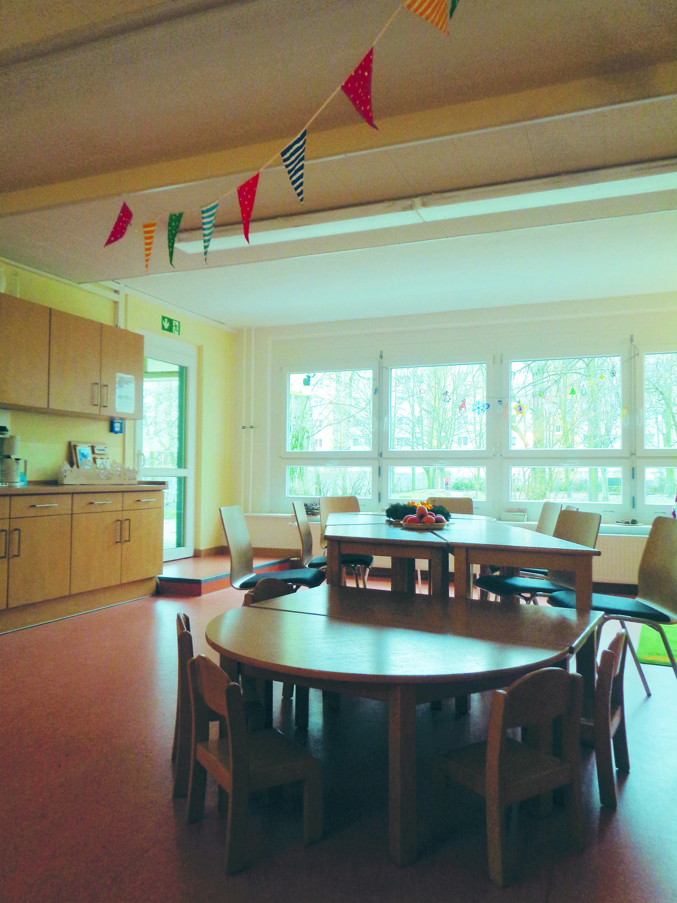
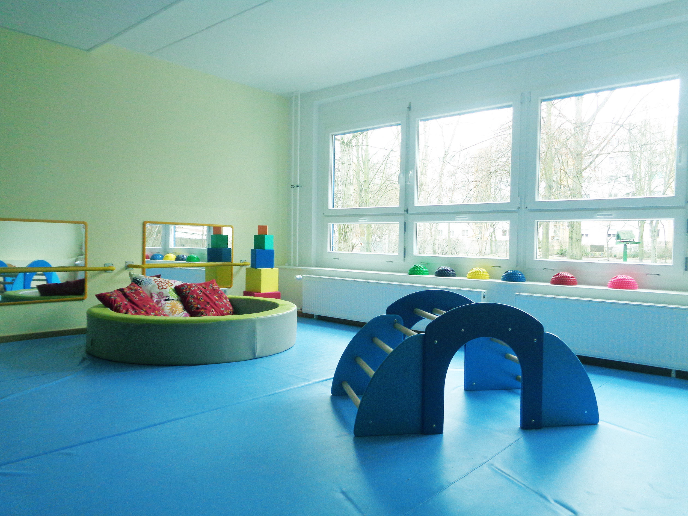
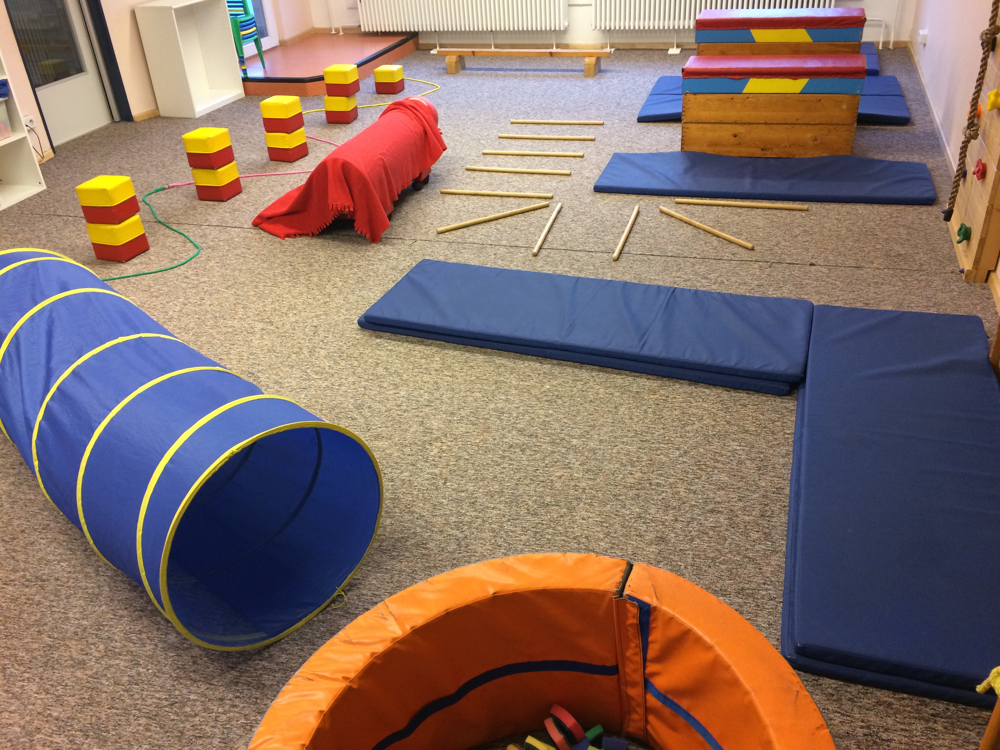

## Familienzentrum Matenzeile

## Zielgruppe
Familien mit Kindern zwischen 0-6 Jahren, Schwangere, Mütter, Väter, Alleinerziehende, Familien mit Fluchterfahrung

## Offen
Mo-Fr (vormittags & nachmittags) 
siehe Wochenplan

## Angebote
Hebammensprechstunde, Eltern-Kind-Sport, Krabbelgruppen, Spiel & Bewegung für die Kleinsten, Offener Eltern-Kind-Treff mit Hebamme, Offene Familiennachmittage, Musikgarten, Babymassage, Nähkurs, Sprechstunde zu Familienfragen, Raumnutzung, Workshops & Feste

## Links
<a class="external_link" href="https://www.familienanlauf.de/familienzentrum">Website</a>

## Wo

 
Matenzeile (im EG der Kita "Freche Früchtchen")

## Kontakt
[familienzentrum@familienanlauf.de](mailto:familienzentrum@familienanlauf.de) 
<a href="tel:+4915209080072">0152 0908 0072</a>

## Eindrücke

  
  
  
  
  
  

