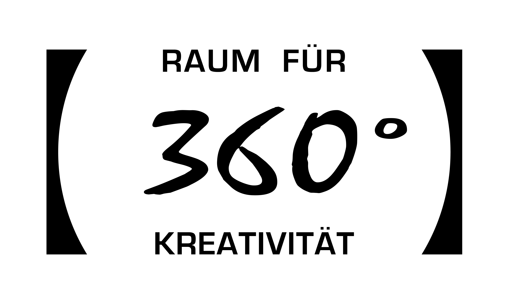
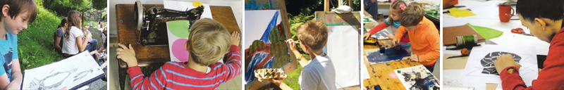
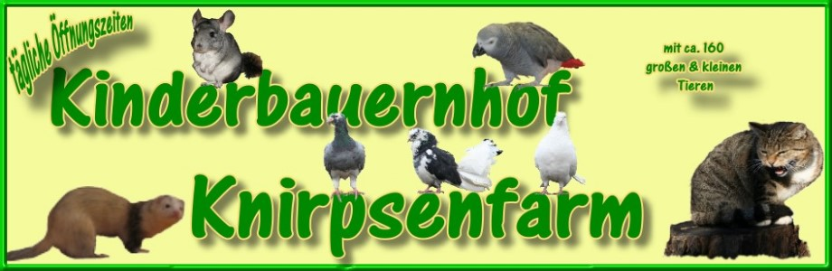

## Freizeit

 <label class="Freizeit" onclick="javascript:window.open('360Grad.html', '_self')">
     360 Grad - Raum für Kreativität
  </label>
  <label class="Freizeit" onclick="javascript:window.open('Bibliothek.html', '_self')">
     Anna-Seghers-Bibliothek
  </label>
   <label class="Freizeit" onclick="javascript:window.open('JUKS.html', '_self')">
     Jugendkunstschule Lichtenberg
  </label>
  <label class="Freizeit" onclick="javascript:window.open('Kieztreff.html', '_self')">
     Kieztreff Lebensnetz
  </label>
   <label class="Freizeit" onclick="javascript:window.open('Knirpsenfarm.md', '_self')">
     Knirpsenfarm
  </label>
   <label class="Freizeit" onclick="javascript:window.open('SchuleFrieden.html', '_self')">
     Schule des Friedens
  </label>
  
 

