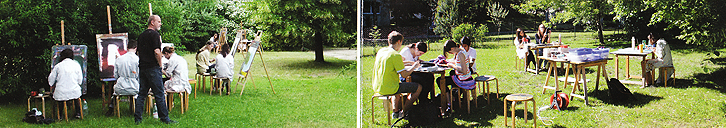
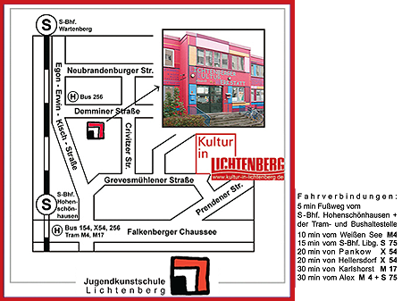

## JUKS - JugendKunstschule Lichtenberg

## Offen
Mo-Fr 10-18 Uhr

## Aktivitäten

Malerei, Hoch-, Tief-, Siebdruck, Bildhauerei & Plastik, Keramik, Textilkunst & Filzen, Schwarz-Weiss-Fotografie & digitale Bildbearbeitung, Tanz & darstellendes Spiel 
Kurse, Wochenendworkshops, individuelle Werkstattnutzung

## Links
<a class="external_link" href="http://www.juks-lichtenberg.de">Webseite</a>

## Zielgruppe
(3-)6 - 27(-100) Jahre

## Kontakt
[mail@juks-lichtenberg.de](mailto:mail@juks-lichtenberg.de) 
<a href="tel:+49309248873">030 924 8873</a>

## Wo

## Eindrücke

  
  
  

