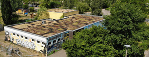

## JFE Welseclub

- Adresse:      Vincent-van-Gogh-Str.36,  13057 Berlin
- Offen:        Montag-Donnerstag von 13-20 Uhr, Freitag 13-21 Uhr
- Alter:        10-27 Jahre
- Kontakt:      jfe.welseclub@pad-berlin.de, 030 / 920 50 49
- [Website](https://www.pad-berlin.de/jugendarbeit-praevention-und-qualifikation/jfe-welseclub)
- Angebote:     Ludothek (Gesellschaftsspiele ausleihen), Rollenspiele, Fahrradwerkstatt, Gartenprojekt, Kochen/Backen, Computerraum,  Sportraum, Billard, Kicker, Tischtennis, Familiensonntage, Theatergruppe, Kampfkunst
- Institution:  [pad gGmbH](https://www.pad-berlin.de/)

### Fotos

