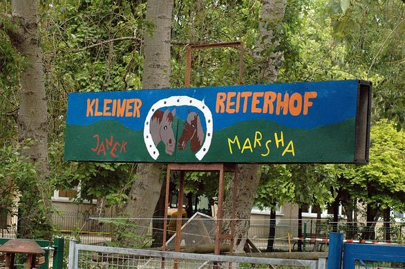

## ASP Fort Robinson

## Wochenplan
<pre id="weeklyschedule">
Mo  geschlossen
Di  14-18  Hüttenbau
Di  16-18  Pferde AG
Mi  13-15  Betreuung Pferde
Mi  16-18  Reiten & Stockbrot
Mi  14-18  Lagerfeuer
Do  14-18  Hüttenbau
Do  14-16  Bogenschießen auf Anfrage
Do  16-18  Pferde AG
Fr  13-15  Gärtnern
Fr  16-18  Kochen/Grillen über Lagerfeuer
Sa  10-17  offene Spielangebote
</pre>

## Offen
Di-Fr 13-19 Uhr 
Sa 10–17 Uhr 
(in den Ferien ab 10 Uhr)

## Angebote

Pferde AG für Anfänger & Fortgeschrittene, Reiten, Stockbrot, Hüttenbau, Bogenschießen, Grillen, Gärtnern, Angebote für Gruppen im Vormittagsbereich, Beratung junger Eltern von 12-13 Uhr nach Anmeldung

## Links
<a target="_blank" href="http://www.kietzfuerkids.de/fort-robinson/">Website</a> 
<a target="_blank" href="https://www.facebook.com/pages/Fort-Robinson-ASP/294121017862787">Facebook</a>

## Zielgruppe
6-14 Jahre

## Kontakt
[asp@kietzfuerkids.de](mailto:asp@kietzfuerkids.de) 
<a href="tel:+49309208192">030 9208 192</a>

## Wo

## Eindrücke

  
  
  
  

