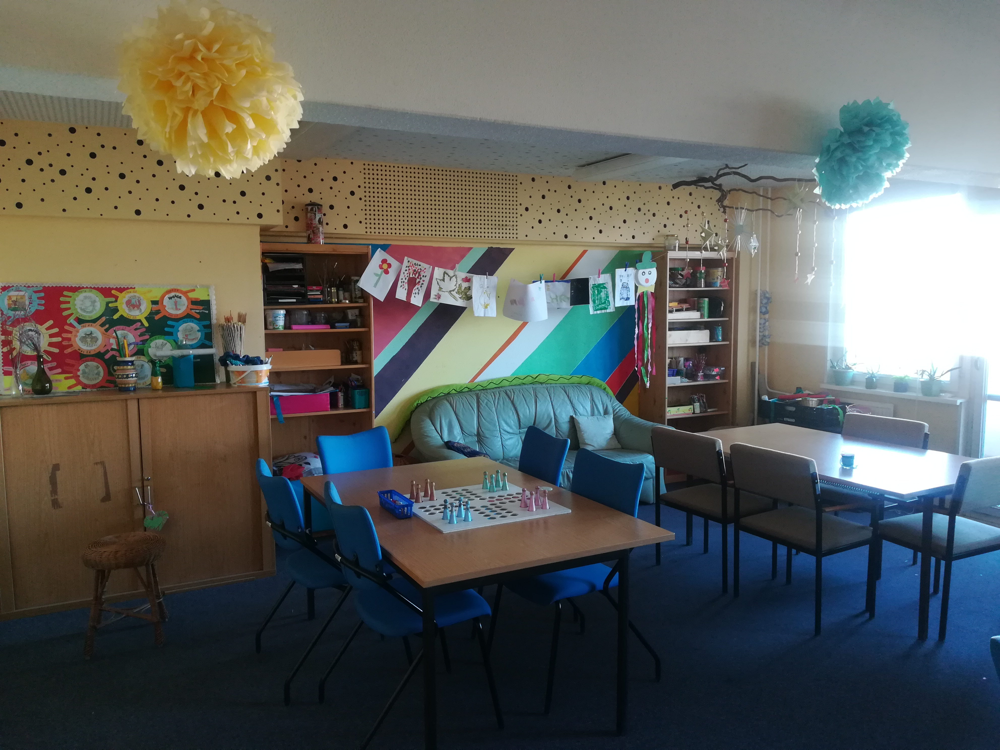

## Ausblick

## Wochenplan
  

## Offen
Mo-Fr 13-19 Uhr

## Aktivitäten

Ausflüge, Kochen & Backen, Basteln, Hausaufgabenbetreuung, Konsolen- & Computerraum, Malen, Kicker, Dart,  Tischtennis, Gesellschaftsspiele, Foto und Video AG und Filmnachmittag

## Links
<a class="external_link" href="https://www.freizeitclub-ausblick.de/">Webseite</a> 
<a class="external_link" href="https://www.facebook.com/ausblickberlin/">Facebook</a> 

## Zielgruppe
Kinder & Jugendliche 6 bis 20 Jahren

## Kontakt
[Ausblickberlin@yahoo.de](mailto:Ausblickberlin@yahoo.de) 
<a href="tel:+49309237093">030 9237 093</a>

## Wo

## Eindrücke

  

