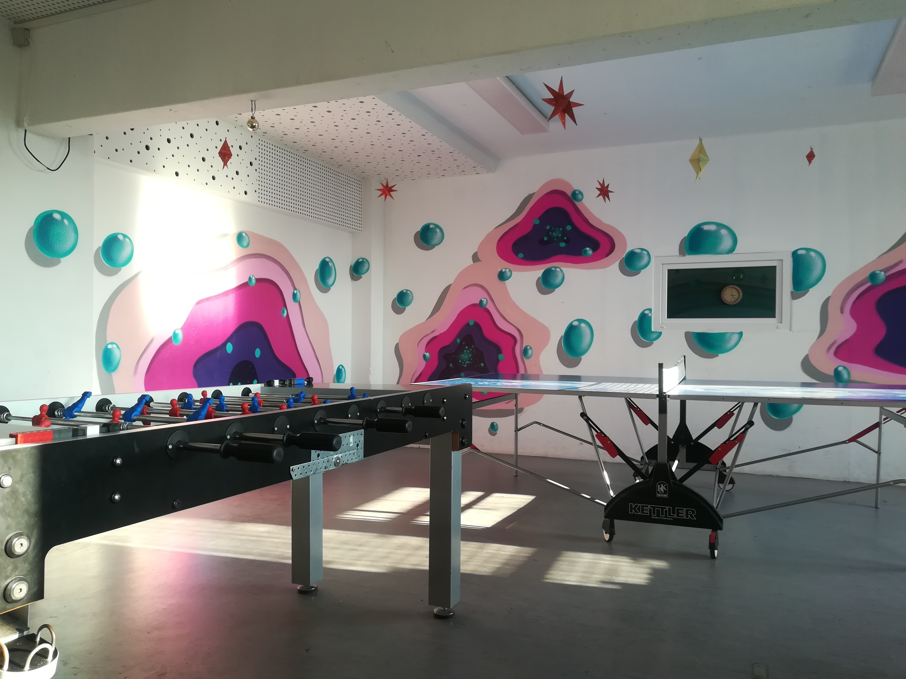

## Ausblick

## Wochenplan
<pre id="weeklyschedule">
Mo  16:00  Back AG
Di  15:30  Basteln
Mi  16:00  Koch AG
Do  16:00  Sporttunier/Bowling letzten Do im Monat
Fr  15:30  Kaffeetafel
</pre>

## Offen
Mo-Fr 13-19 Uhr

## Aktivitäten

Ausflüge, Kochen & Backen, Basteln, Hausaufgabenbetreuung, Konsolen- & Computerraum, Malen, Kicker, Dart, Billard, Tischtennis, Gesellschaftsspiele

## Links
<a target="_blank" href="https://www.freizeitclub-ausblick.de/">Webseite</a> 
<a target="_blank" href="https://www.facebook.com/ausblickberlin/">Facebook</a> 

## Zielgruppe
Kinder & Jugendliche 10-24 Jahre

## Kontakt
[Ausblickberlin@yahoo.de](mailto:Ausblickberlin@yahoo.de) 
<a href="tel:+49309237093">030 9237 093</a>

## Wo

## Eindrücke

  
  

