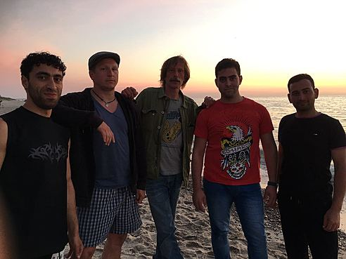
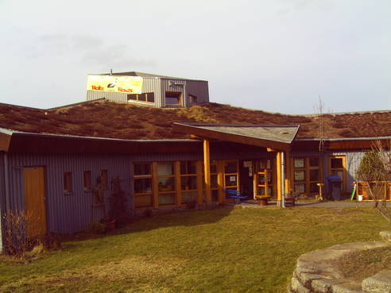

## Kinder- & Jugendclub Holzwurmhaus

|||
-:|:-
**Adresse** |     Falkenberger Chaussee 141, 13059 Berlin 
**Offen** |       Mo 14-20 Uhr, Di-Fr 12:30-20 Uhr
**Alter** |       8-18 Jahre
**Kontakt** |     [Holzwurmhaus@sozdia.de](mailto:mikado@kietzfuerkids.deHolzwurmhaus@sozdia.de) <a href="tel:+493096201977">030 9620 1977</a>
**Website** |    <a target="_blank" href="http://www.sozdia.de/Wir-ueber-uns.1751.0.html">Website</a> <a target="_blank" href="https://www.facebook.com/j.mann.lindner">Facebook</a>
**Angebote** |    Billiard, Kicker, Dart, Airhockey, im Sommer: Pool, kleines Fußball-& Volleyballfeld, Hüttenbau, Kochangebote usw.
**Institution** | Sozialdiakonische Arbeit Berlin GmbH

## Fotos

  
  

