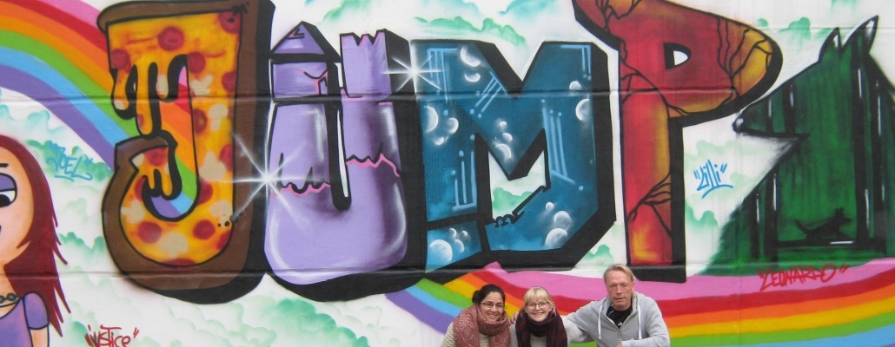
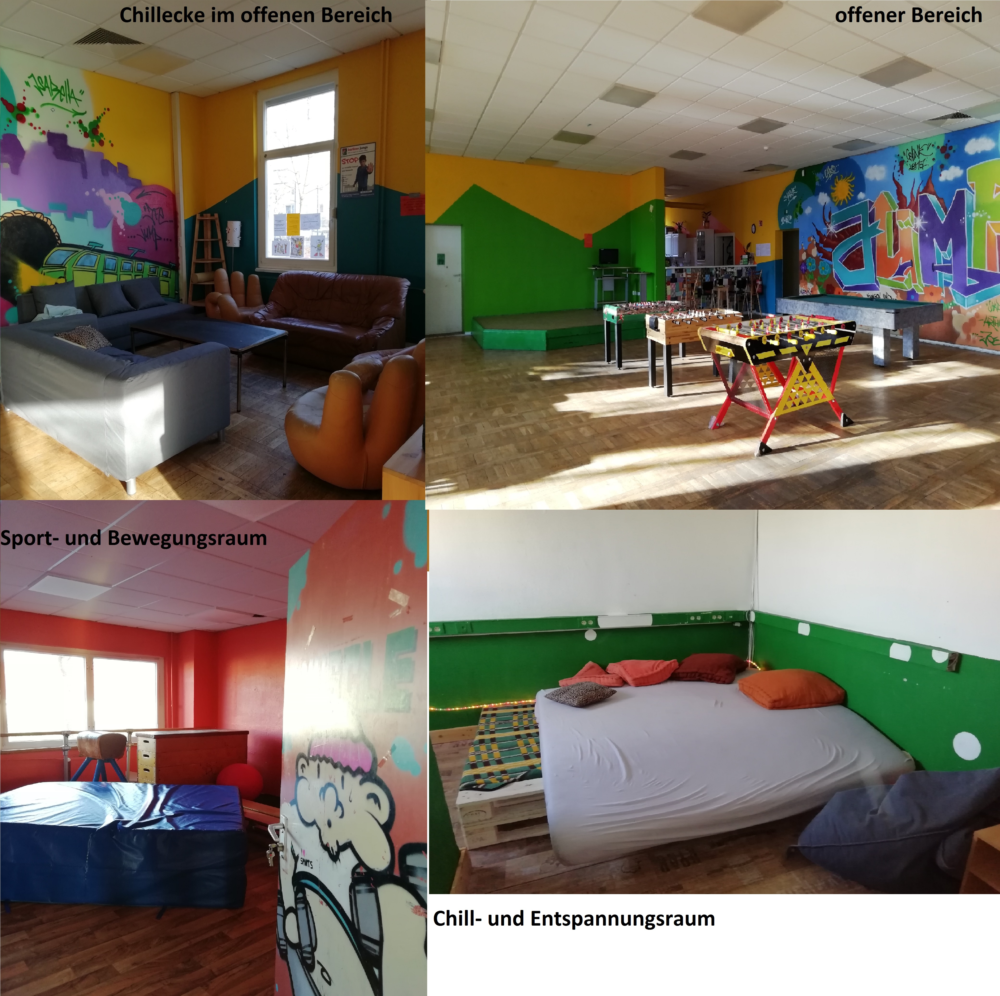

## JFE JUMP

## Wochenplan
<pre id="weeklyschedule">
Mo 16-17  Kochen & gemeinsam essen
Di 15:30  Sport für alle
Di 17:00  gemeinsam Essen
Mi 15-16  gemeinsames Lernangebot
Mi 16-17  Kochen & gemeinsam Essen
Do 15:30  Sport für alle
Do 17:00  gemeinsam Essen
</pre>

## Offen
Mo-Do 14-19 Uhr

## Angebote

Skaten/BMX & Scooter, Fußball, Volleyball, Basketball, Tischtennis, Kickern, Kreatives Gestalten, Kochen, Ferienprogramm, Workshops

## Links
<a target="_blank" href="http://jump.kietz-fuer-kids-freizeitsport.de/">Website</a>

## Zielgruppe
8-15 Jahre

## Kontakt
[jump@kietz-fuer-kids-freizeitsport.de](mailto:jump@kietz-fuer-kids-freizeitsport.de)

## Wo

## Eindrücke

  
  

