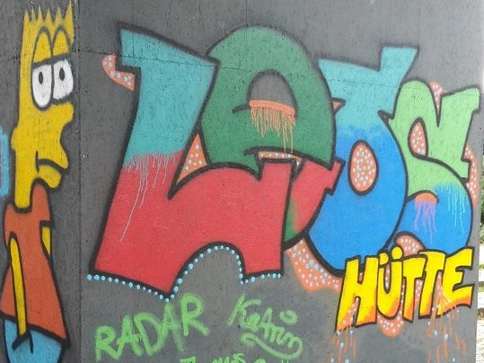

## JFE LEOS HÜTTE

## Wochenplan
<pre id="weeklyschedule">
Mo 16-20 Küchengespräche, Basteln
Mo 18:00 Zumba
Di 16-18 Graffiti/Comic, Multimedia
Mi 14-18 Multimedia
Mi 17-19 Breakdance
Do 15-18 Musizieren 
Do 16-19 Kreatives Gestalten
Fr 15-17 Musizieren
Fr 16-20 Freizeitsport 
Sa 12-15 Fußball (Halle Welsestr.)
</pre>

## Offen
Mo 14-20 Uhr 
Di-Fr 12:30-20 Uhr

## Angebote

Billard, Tischtennis, Kicker, Darts, Zumba, Graffiti, Breakdance, Computer, Bildbearbeitung, Freizeitsport, Kochen, Handarbeit, Kreatives Gestalten & Nähen, Erlebnispädagogik, Multimedia-Spiele, Gesellschaftsspiele, Musik                     

## Links
<a target="_blank" href="http://leos-huette.de/">Website</a>

## Zielgruppe
6-17 Jahre

## Kontakt
[info@leos.libg-jugend.de](mailto:info@leos.libg-jugend.de) 
<a href="tel:+49309287116">030 9287 116</a>
 

## Wo

## Eindrücke

 
 
 
 

