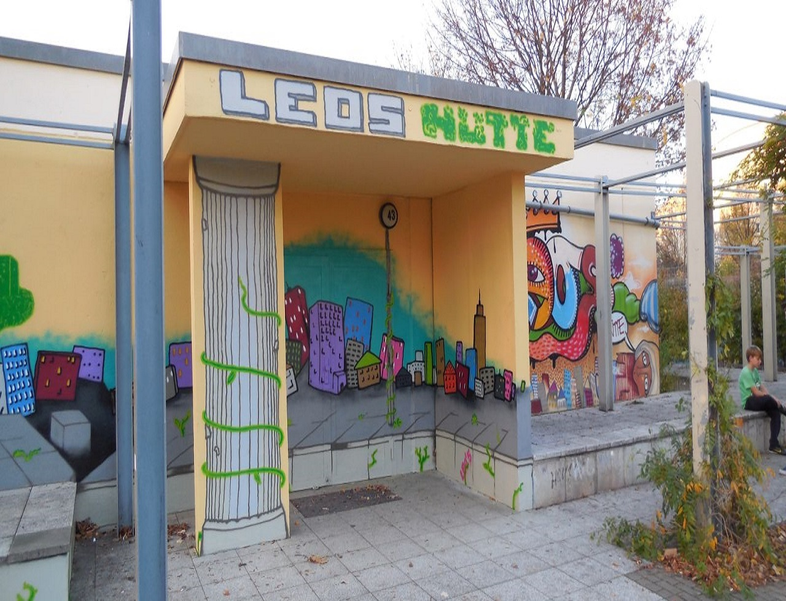
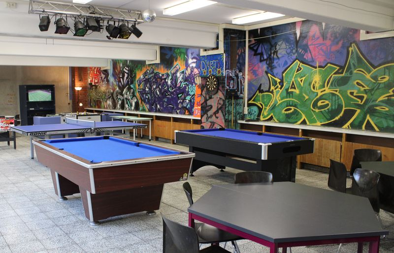
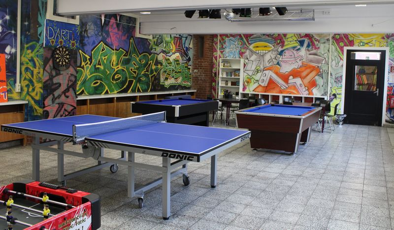
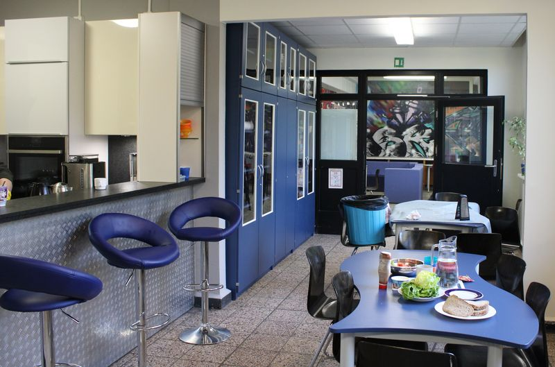

## JFE Leos Hütte

## Wochenplan
<pre id="weeklyschedule">
Mo  14:00-18:00  Basteln & Nähen
Mo  16:00-20:00  Daddeln/Zocken
Mo  18:00-19:30  Zumba
Di  14:00-19:00  Computerclub
Di  16:00-18:00  Graffiti/Comic, Multimedia
Mi  14:00-18:00  Multimedia
Mi  14:00-19:00  Computerclub
Do  15:00-18:00  Musizieren 
Do  16:00-19:00  Kreatives Gestalten
Do  16:00-20:00  Daddeln/Zocken
Do  17:00-19:00  Breakdance
Do  19:30-22:00  Hallenfußball (Prendener Str.)
Fr  15:00-17:00  Musizieren
Fr  16:00-20:00  Freizeitsport & Computer
Sa  12:00-15:00  Fußball (Halle Welsestr.)
</pre>

## Offen
Mo 14-20 Uhr 
Di-Fr 12:30-20 Uhr

## Angebote

Billard, Tischtennis, Darts, Kicker, Karten- & Brettspiele, Fußball, Basketball, Volleyball, Computer/Konsolen, Erlebnispädagogik, Gitarre & Klavier, Nähen, Zeichnen, Handarbeit, Kochen & Backen, Tanzen, Bildbearbeitung                     

## Links
<a target="_blank" href="http://leos-huette.de/">Website</a>

## Zielgruppe
6-17 Jahre

## Kontakt
[info@leos.libg-jugend.de](mailto:info@leos.libg-jugend.de) 
<a href="tel:+49309287116">030 9287 116</a>
 

## Wo

## Eindrücke

 
 
 
 

