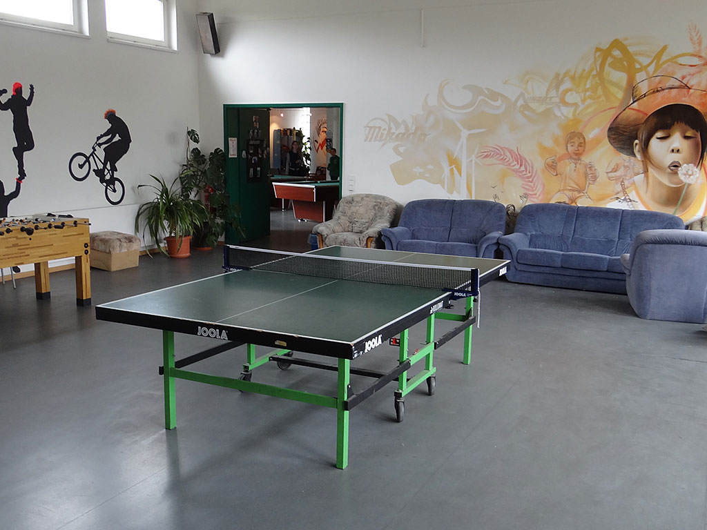
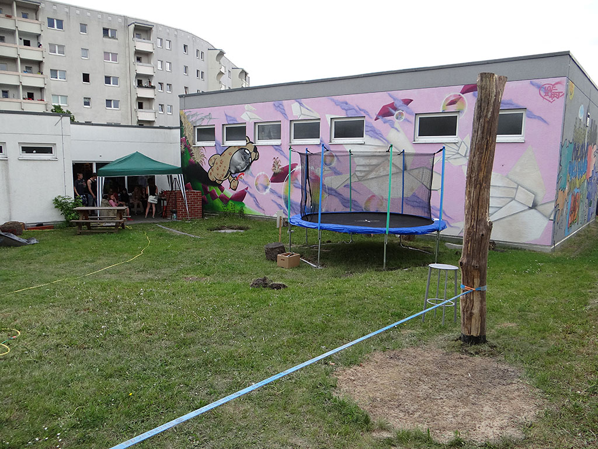

## JFE Mikado

## Wochenplan
<pre id="weeklyschedule">
Mo 16-18   AG Garten
Di 15-18   AG Klavier
Mi 14:30   AG Brush
Mi 17-20   Kinotag
Do 15-18   AG Klavier
Do 17-19   AG Garten
Fr 15-17   AG Kochen
Fr 18-20   Spieleabend
</pre>

## Offen
Mo-Fr 13-20 Uhr

## Angebote

Kreativangebote z.B. Airbrush, Graffiti  u. Siebdruck / Airbrush, Gärtnern im Garten, ernährungsbewusstes Kochen & Backen, Klavierstunden & Musizieren im Tonstudio, Tanzgruppen, Tischtennis, Basketball, Billiard, Kickern, Chillen, Dart, Trampolinspringen, Holzbrandmalerei, Playstation 3, Kinoabende, Bewerbungstraining, Hausaufgabenhilfe / Hausaufgabenbetreuung, Hilfestellungen bei Alltagsproblemen jeglicher Art, Fahrrad- & Holzwerkstatt, Gesellschafts- & Rollenspiele, Ausflüge, Ferienfahrten

## Links
<a target="_blank" href="https://kietzfuerkids.de/mikado/">Website</a> 
<a target="_blank" href="https://www.facebook.com/jugendclub.mikado">Facebook</a>

## Zielgruppe
12-21 Jahre

## Kontakt
[mikado@kietzfuerkids.de](mailto:mikado@kietzfuerkids.de) 
<a href="tel:+493086459276">030 8645 9276</a>

## Wo

## Eindrücke

  
  
  
  
 

