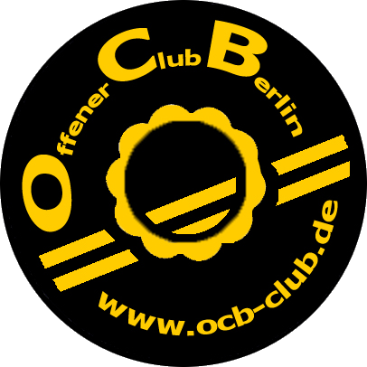
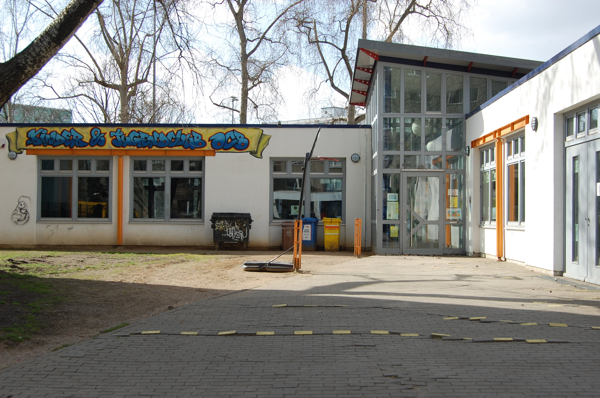
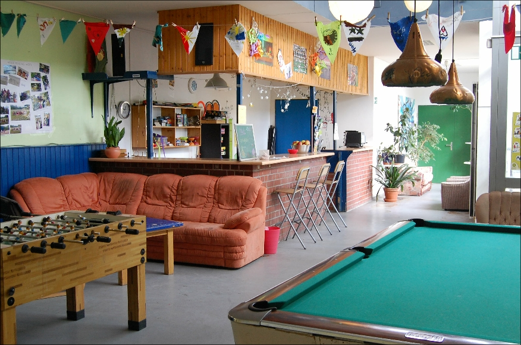
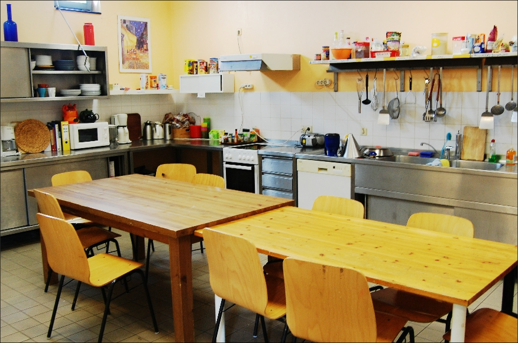
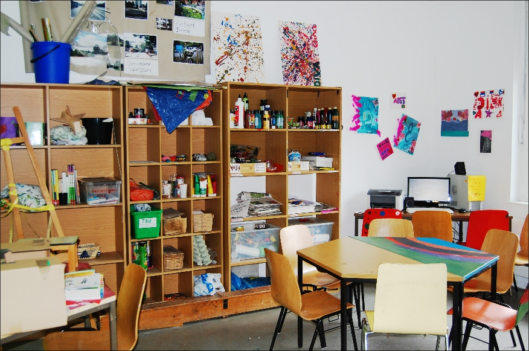
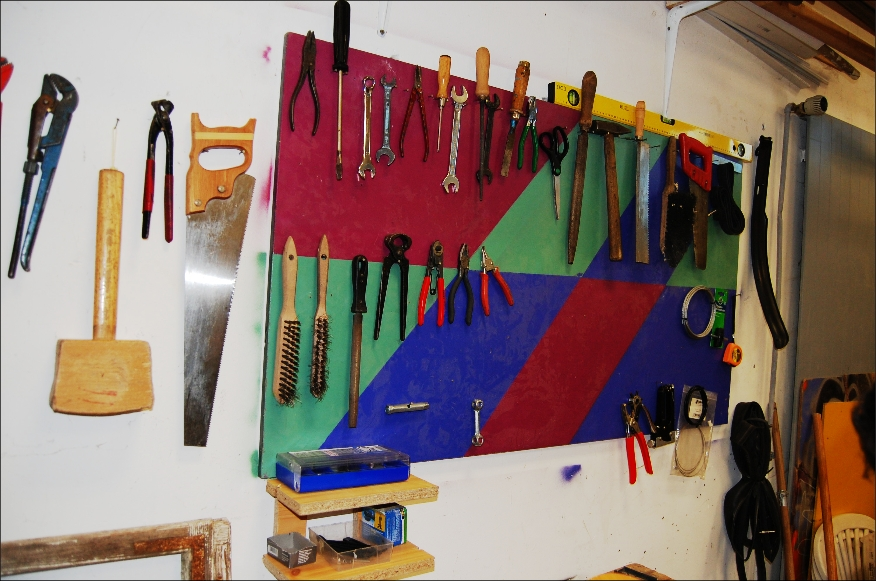
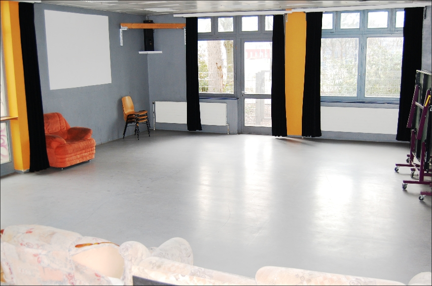

## Offener Club Berlin

## Wochenplan
<pre id="weeklyschedule">
Mo 16:00 Kochen (Mädchen*tag)
Di 16:00 Kochen
Di 18-20 Jugendzeit (ab 14 Jahren)
Mi 15:00 Gartenprojekt
Do 14:00 Siebdruck (Anmeldung)
Do 16:00 Tischtennistraining
Do 17:00 Kochen
Fr 14:30 Fußball (Kinderhaus Halle)
Fr 17:00 OCB draußen oder Kino
</pre>

## Offen
Mo 13-19 Uhr (Mädchen*tag)  
Di 13-20 Uhr 
Mi 15-19 Uhr  
Do 13-20 Uhr 
Fr 13-19 Uhr

## Aktivitäten

Bistro/Küchennutzung, Kochprojekt, Bandraum, Billard, Tischtennis, Fußball, Wii, Gesellschaftsspiele, Kicker, Unterstützung bei Hausaufgaben & Bewerbung, Kino, Chillen, Beratung, Clubversammlung, Siebdruck

## Links
<a class="external_link" target="_blank" href="www.ocb-club.de">Webseite</a> 
<a class="external_link" target="_blank" href="https://www.facebook.com/offener.jugendclub">Facebook</a> 
<a class="external_link" target="_blank" href="https://www.instagram.com/offener.club.berlin">Instagram</a>

## Zielgruppe
Kinder & Jugendliche 10-20 Jahre

## Kontakt
[ocb@vav-hhausen.de](mailto:ocb@vav-hhausen.de) 
<a href="tel:+493097104927">030 9710 4927</a>

## Wo

## Eindrücke

  
  
  
  
  
  

