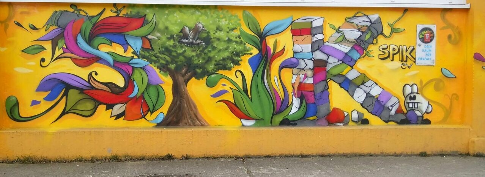

## SPIK Jugendklub

|||
-:|:-
**Adresse** |     Am Berl 15, 13051 Berlin
**Offen** |       Mo–Fr 14–20 Uhr 1.+ 3. Sa Sporthalle 13-17 Uhr
**Alter** |       10–21 Jahre
**Kontakt** |     [jfe@spikev.de](mailto:jfe@spikev.de) <a href="tel:+493092092879">030 9209 2879</a>
**Social Media** |    <a target="_blank" href="http://www.spikev.de/jugendfreizeiteinrichtung-fuer-menschen-ab-12/">Webseite</a> <a target="_blank" href="https://www.facebook.com/spik.ev.3/">Facebook</a> <a target="_blank" href="https://www.instagram.com/jugendclub.spik/">Instagram</a>

**Angebote** |    Kochen, Graffiti, Bandraum, Musik, Kunst, Keramik, Zeichnen, Aikido, Tanzen, Sport (Tischtennis, Fußball, Basketball, Frisbee), Billard, Kicker, Jonglieren, Garten mit Hängematten, Holzwerkstatt, Gesellschaftsspiele, PC-Ecke, Hausaufgabenhilfe, Beratung, Ferienangebote, Ausflüge, Übernachtungen, Lagerfeuer, Grillen, Chillen, Interkulturelles
**Institution** | Sozialpädagogische Arbeit im Kiez (SPIK) e.V.

## Fotos

