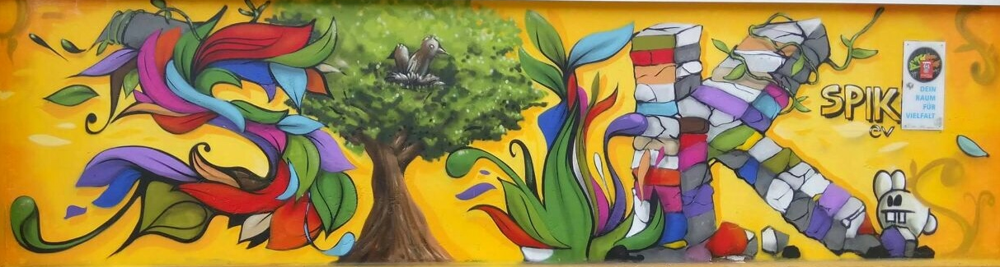
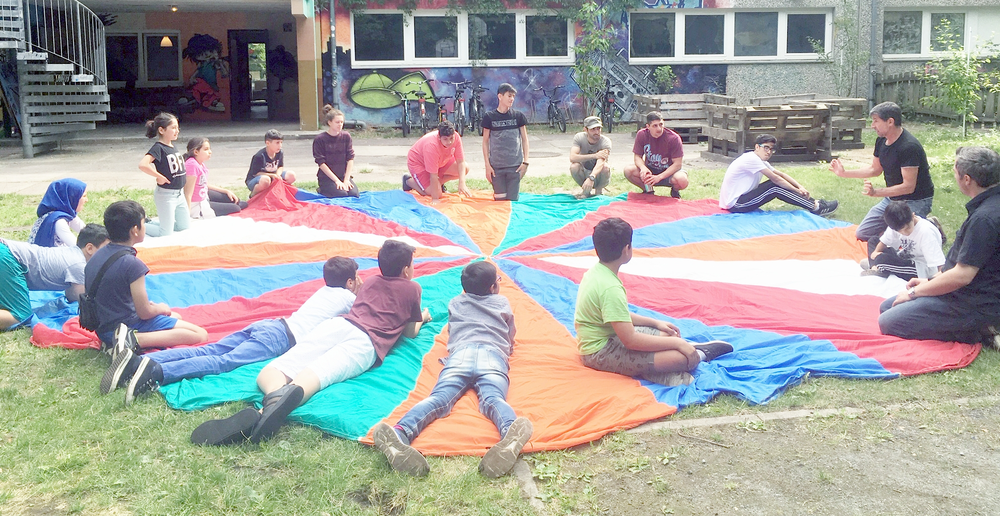
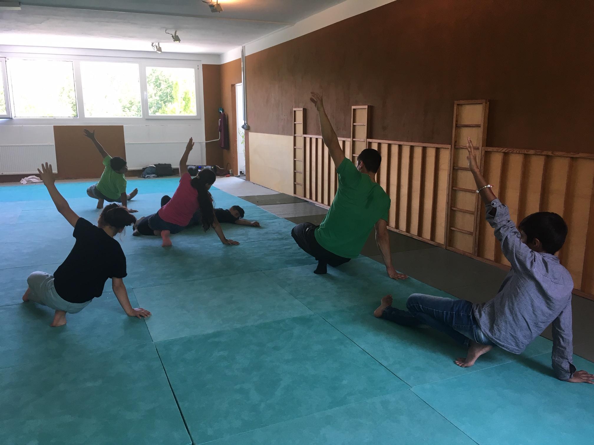
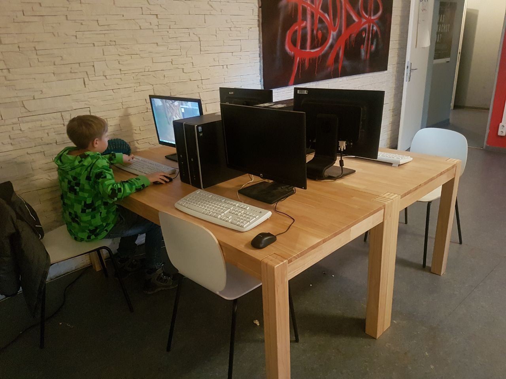
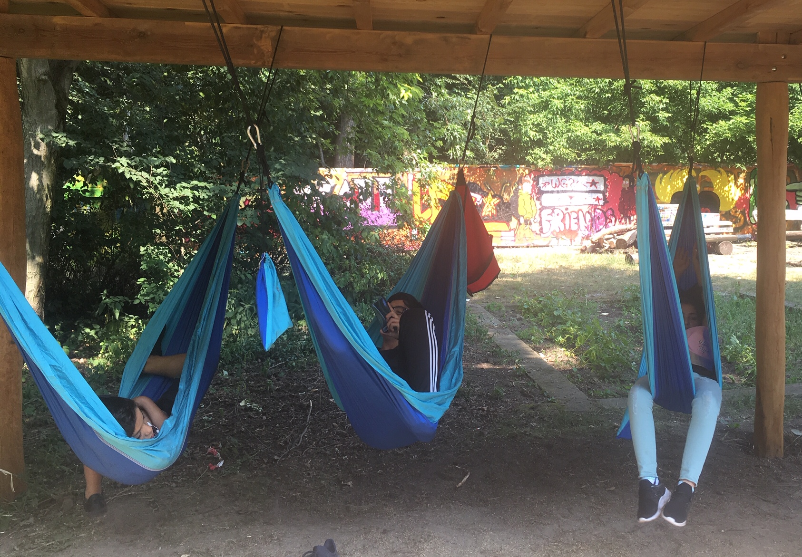
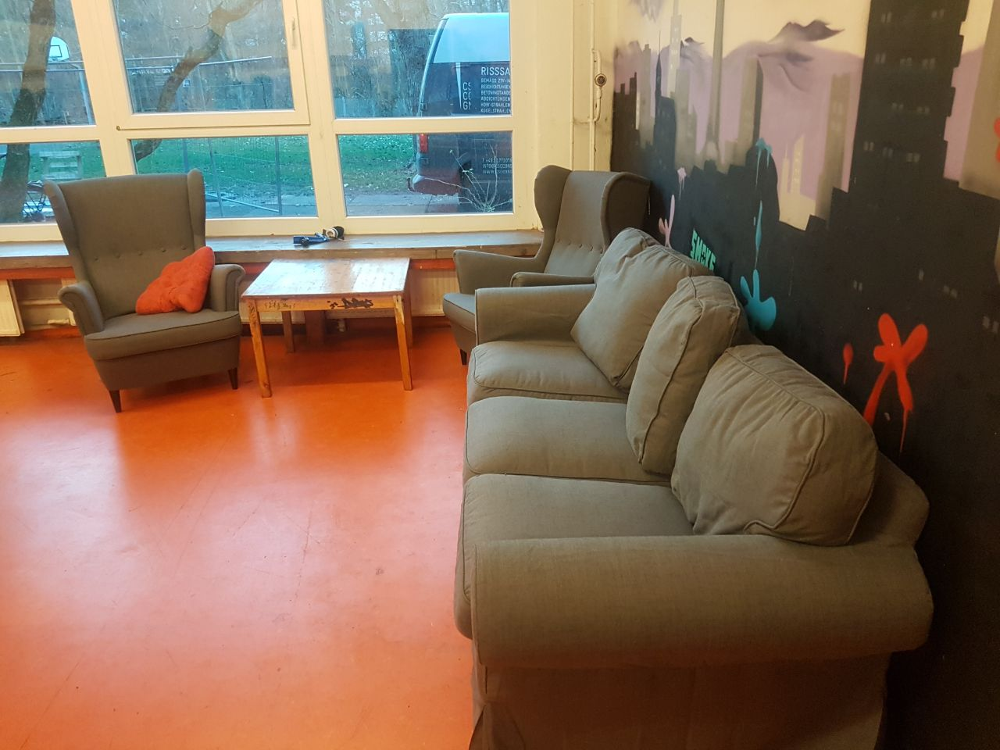
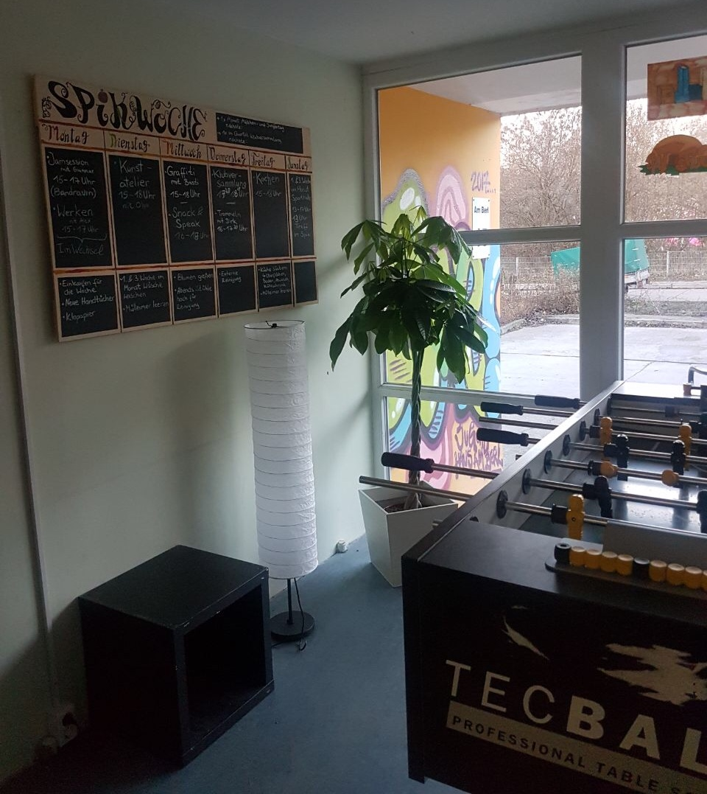
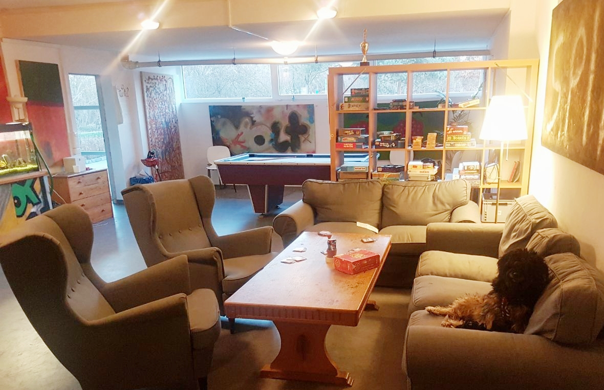

## SPIK Jugendklub

## Wochenplan
<pre id="weeklyschedule">
Mo  15-17  Bandraum
Di  15-17  Kunst & Werken
Mi  15-18  Graffiti
Do  15-17  Fitness/Jin-Jitsu
Fr  14-20  PC-Tag & Kochen
Sa  13-17  Hallensport
</pre>

## Offen
Mo-Fr 14-20 Uhr

## Aktivitäten

Kochen, Graffiti, Bandraum, Musik, Kunst, Keramik, Zeichnen, Aikido, Tanzen, Sport (Tischtennis, Fußball, Basketball, Frisbee), Billard, Kicker, Jonglieren, Garten mit Hängematten, Holzwerkstatt, Gesellschaftsspiele, PC-Ecke, Hausaufgabenhilfe, Beratung, Ferienangebote, Ausflüge, Übernachtungen, Lagerfeuer, Grillen, Chillen, Interkulturelles

## Links
<a target="_blank" href="http://www.spikev.de/jugendfreizeiteinrichtung-fuer-menschen-ab-12/">Webseite</a> 
<a target="_blank" href="https://www.facebook.com/spik.ev.3/">Facebook</a> 
<a target="_blank" href="https://www.instagram.com/jugendclub.spik/">Instagram</a>

## Zielgruppe
Jugendliche 10-21 Jahre

## Kontakt
[jfe@spikev.de](mailto:jfe@spikev.de) 
<a href="tel:+493092092879">030 9209 2879</a>

## Wo

Am Berl 15, 13051 Berlin

## Eindrücke

  
  
  <!--//-->
  <!--//-->
  <!--//-->
  <!--//-->
  

