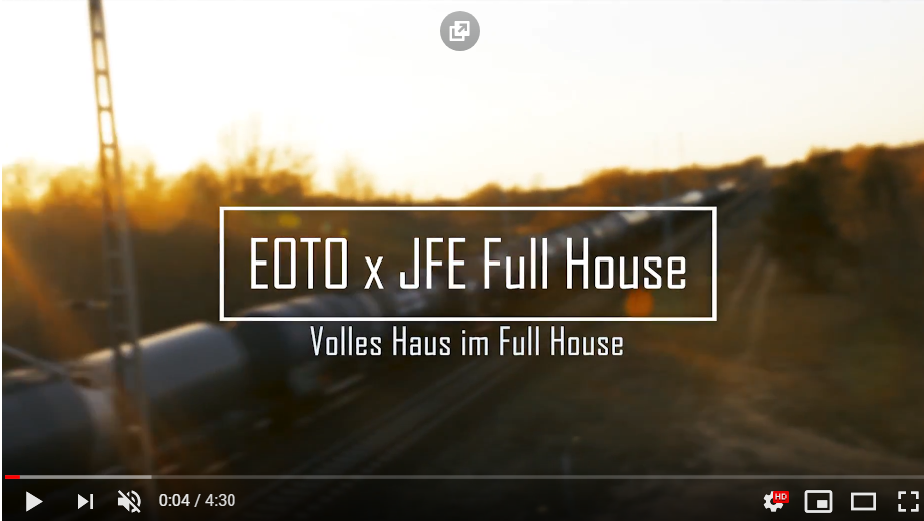

## JFE Full House

|||
-:|:-
**Adresse** |     Ribnitzer Straße 30, 13051 Berlin
**Offen** |       Mo–Fr 13–20 Uhr
**Alter** |       10–21 Jahre
**Kontakt** |     [jfe.fullhouse@pad-berlin.de](mailto:jfe.fullhouse@pad-berlin.de) <a href="tel:+493096208994">030 9664 8994</a>
**Webseite** |     <a target="_blank" href="https://www.pad-berlin.de/jugendarbeit-praevention-und-qualifikation/jfe-full-house">Webseite</a> <a target="_blank" href="https://www.instagram.com/jfe.fullhouse/">Instagram</a>
**Angebote** |    Kochen/Backen, Volleyball, Fußball, Basketball, Fitness, Holzverarbeitung, Basteln, Malen, Graffiti, Gartenprojekt, Billard, Kicker, Dart, Tischtennis, Gesellschaftsspiele, Hausaufgabenhilfe, Bewerbungstraining, Tagesausflüge, Fahrradwerksattt, Computerraum, Mädchenraum, Workshops
**Institution** | <a target="_blank" href="https://www.pad-berlin.de/">pad gGmbH</a>

## Fotos/Videos

