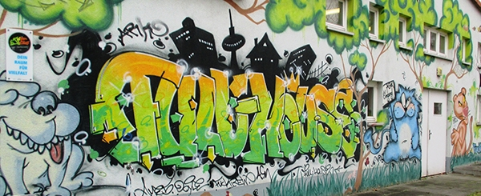

## JFE Full House

## Wochenplan
<pre id="weeklyschedule">
Mo  15:00        Kochen
Mo  20:00-22:00  Fußballtraining
Di  15:00        Fitnesstraining
Di  18:00-20:00  Volleyball (mit Gangway)
Mi  15:00-18:00  Graffiti
Do  15:00        Fitnesstraining
Fr  15:00        Kochen
</pre>

## Offen
Mo-Fr 13-20 Uhr

## Aktivitäten

Fahrradwerkstatt, Gartenprojekt, Mädchenraum, Holzverarbeitung, Graffiti, Fitness, Basteln, Kochen/Backen, Volleyball, Fußball, Basketball, Malen, Billard, Kicker, Dart, Tischtennis, Gesellschaftsspiele, Hausaufgabenhilfe, Computerraum, Bewerbungstraining, Workshops, Tagesausflüge

## Links
<a class="external_link" target="_blank" href="https://www.pad-berlin.de/jugendarbeit-praevention-und-qualifikation/jfe-full-house">Website</a> 
<a class="external_link" target="_blank" href="https://www.instagram.com/jfe.fullhouse/">Instagram</a>

## Zielgruppe
10-21 Jahre

## Kontakt
[jfe.fullhouse@pad-berlin.de](mailto:jfe.fullhouse@pad-berlin.de) 
<a href="tel:+493096208994">030 9664 8994</a>

## Wo

## Eindrücke

  <!-- source: https://fettblog.eu/blog/2013/06/16/preserving-aspect-ratio-for-embedded-iframes/ //-->
  

    <iframe class="embeddedyoutubevideo" width="1280" height="720" src="https://www.youtube-nocookie.com/embed/xLhWAbKMOsA" allow="encrypted-media" allowfullscreen></iframe>
  

