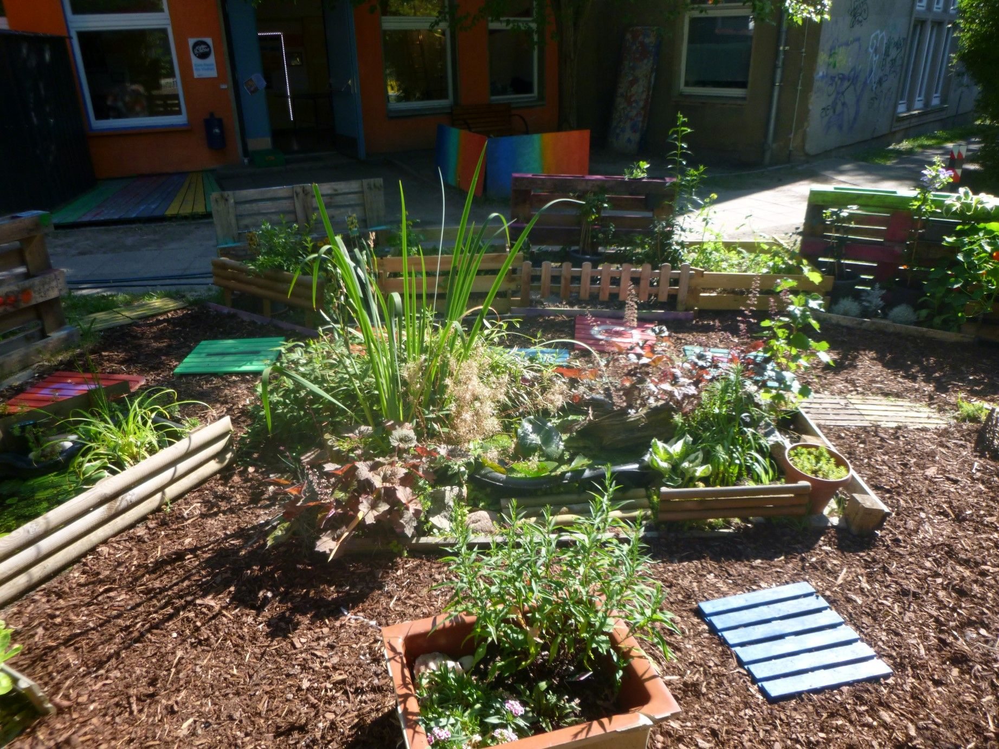
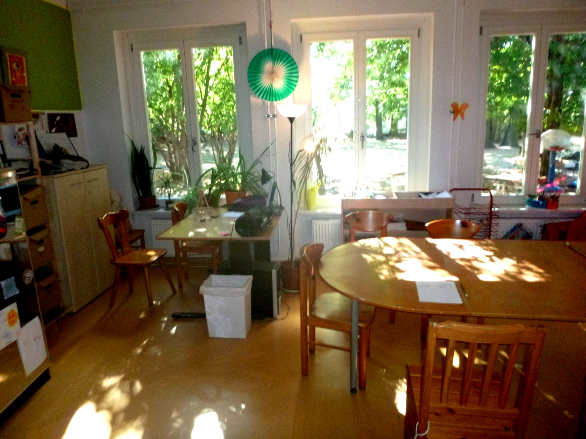
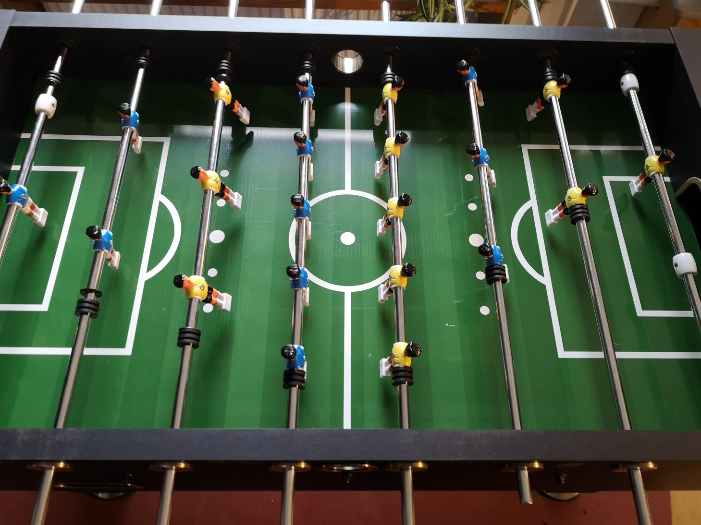
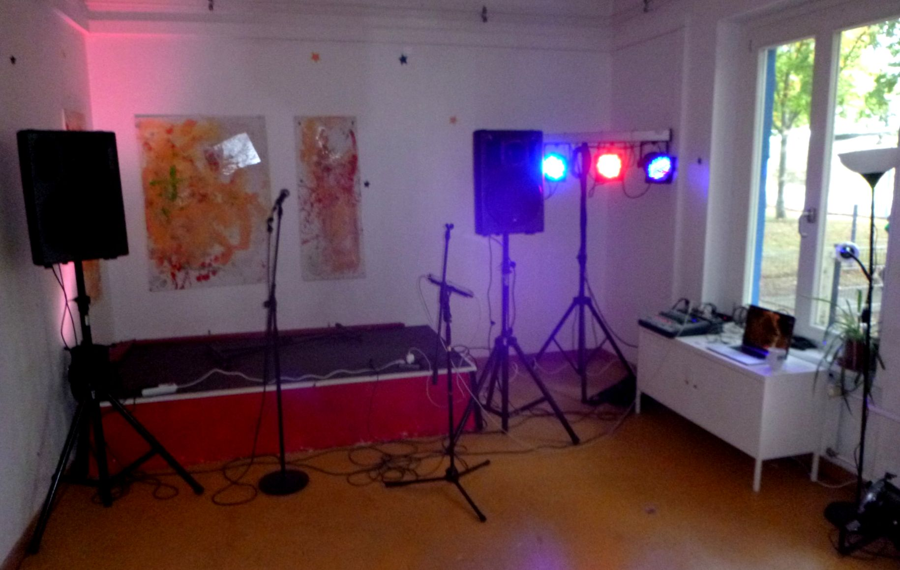

## JFE Funkloch

## Offen
Mo-Fr 12-19 Uhr 
Samstag 13:00-19:00 (2-3x im Monat)

## Angebote
Billard, Kicker, Veranstaltungen, Workshops, Kreativangebote, Kinoangebote bei uns 
Wir entwickeln immer wieder neue Angebote mit euch, für euch! 

## Wochenplan
<pre id="weeklyschedule">
Mo 15-17 Uhr    Backen, Holz/Garten

Di 15-17 Uhr      DIY, Holz/Garten (Bildschirmfrei-Tag)

Mi 15-17 Uhr     Vegetarisch kochen

Mi 14-16 Uhr     Politik Talk an der Bar

Mi 14-17 Uhr     Studio Aufnahme (Anmeldung!) Beats Workshop

Do 15-17 Uhr     Sportangebote, Retro Gaming

Fr 15-17 Uhr      Wunschkochen
</pre>

## Zielgruppe
10 - 18 Jahre

## Links
<a class="external_link" href="https://www.pad-berlin.de/jugendarbeit-praevention-und-qualifikation/jfe-funkloch">Website</a>

## Kontakt
[jfe.funkloch@pad-berlin.de](mailto:jfe.funkloch@pad-berlin.de) 
<a href="tel:+3097997881">030 9799 7881</a> 
<a href="tel:+15234019429">0152 34019429</a> 
Instagram jfefunkloch

## Wo

## Eindrücke

  
  
  
  

