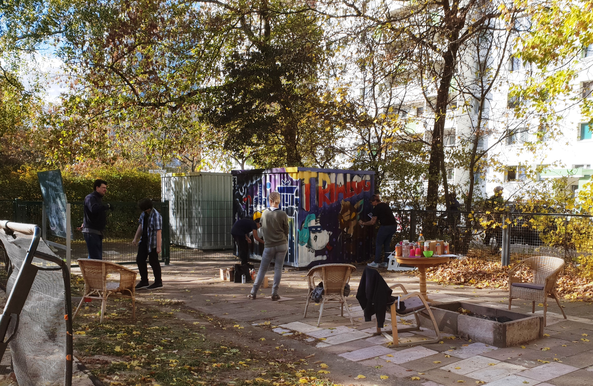
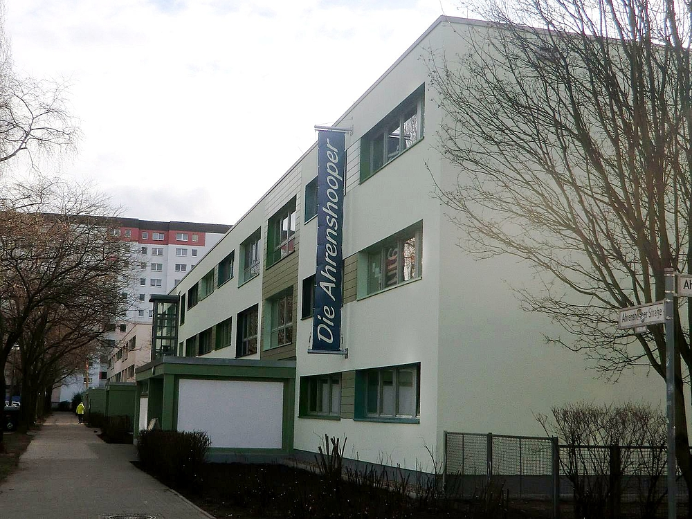
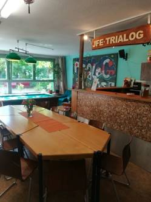

## JFE Trialog

## Wochenplan
<pre id="weeklyschedule">
Mo  17:00  Kekse & Kakao
Di  15:30  Kreativangebot
Mi  16:00  junge Küche
Do  16:00  Sport im Fitnessraum
Fr  15:00  Billiardturnier & Spielenachmittag
</pre>

## Offen
Mo-Fr 13-20 Uhr 
Familiensamstage 12-18 Uhr

## Angebote

Fitnessraum, kostenlose Rechtsberatung (bis 27 Jahren), Vermietung der Räumlichkeiten, Billard, Kicker, Tischtennis, Gartenprojekte, wöchentliches Kochangebot „Junge Küche“, PC-Ecke, Basketball, Beachvolleyball, Beachbar im Garten, Graffiti-Projekte, Lagerfeuerstelle, Hausaufgabenhilfe und Familiensamstage

## Links
<a target="_blank" href="https://www.pad-berlin.de/jugendarbeit-praevention-und-qualifikation/jfe-trialog">Website</a> 
<a target="_blank" href="https://de-de.facebook.com/jfetrialog/">Facebook</a> 
<a target="_blank" href="https://www.instagram.com/jfe.trialog/">Instagram</a>

## Zielgruppe
12-27 Jahre

## Kontakt
[jfe.trialog@pad-berlin.de](mailto:jfe.trialog@pad-berlin.de) 
<a href="tel:+493092407353">030 9240 7353</a>

## Wo

## Eindrücke

  
  
  
  

