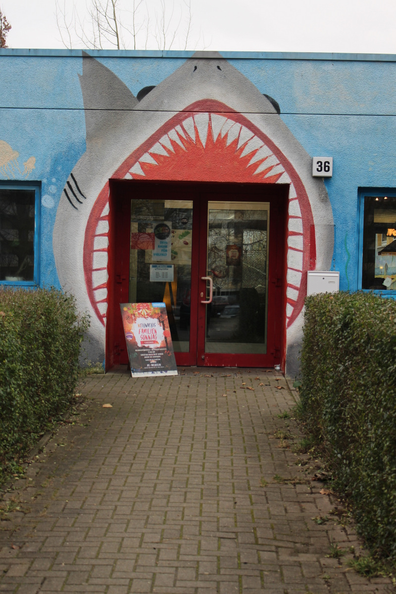
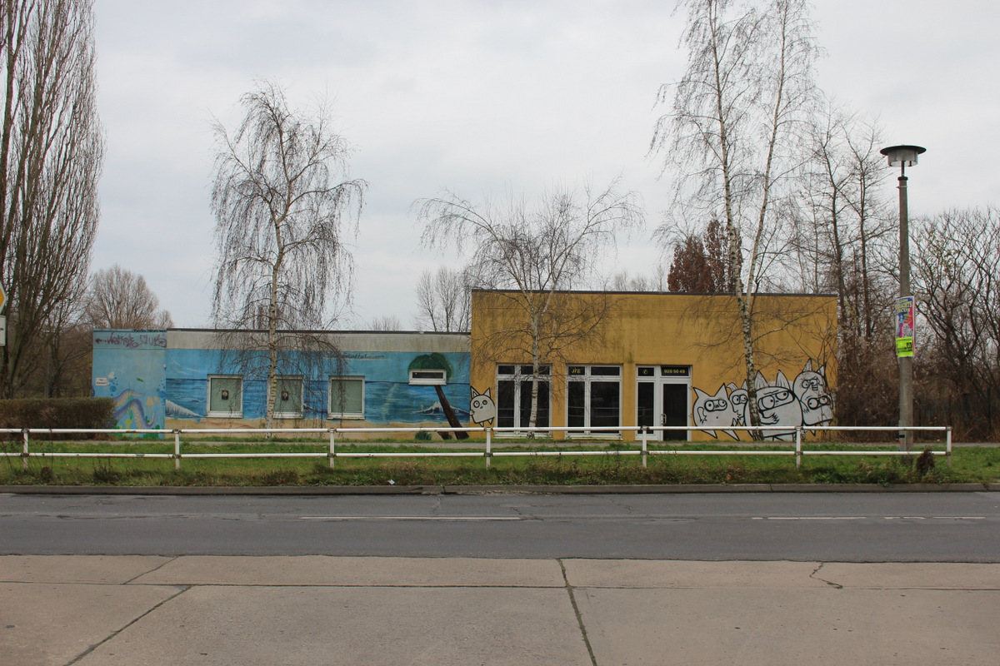

## JFE Welseclub

|||
-:|:-
**Adresse**  |     Vincent-van-Gogh-Str. 36, 13057 Berlin
**Offen** |        Mo–Do 13–20 Uhr Fr 13–21 Uhr
**Alter**   |      10–27 Jahre
**Kontakt** |      [jfe.welseclub@pad-berlin.de](mailto:jfe.welseclub@pad-berlin.de) <a href="tel:+49309205049">030 - 920 50 49</a>
**Webseite** |       <a target="_blank" href="https://www.pad-berlin.de/jugendarbeit-praevention-und-qualifikation/jfe-welseclub">Webseite</a>  <a target="_blank" href="https://www.facebook.com/Welseclub/">Facebook</a>  <a target="_blank" href="https://www.instagram.com/jfe.welseclub/">Instagram</a>
**Angebote** |      Ludothek (Gesellschaftsspiele ausleihen), Rollenspiele, Fahrradwerkstatt, Gartenprojekt, Kochen/Backen, Computer,  Sportraum, Billard, Kicker, Tischtennis, Familiensonntage, Theatergruppe, Kampfkunst
**Institution** |  <a target="_blank" href="https://www.pad-berlin.de/">pad gGmbH</a>

## Fotos

