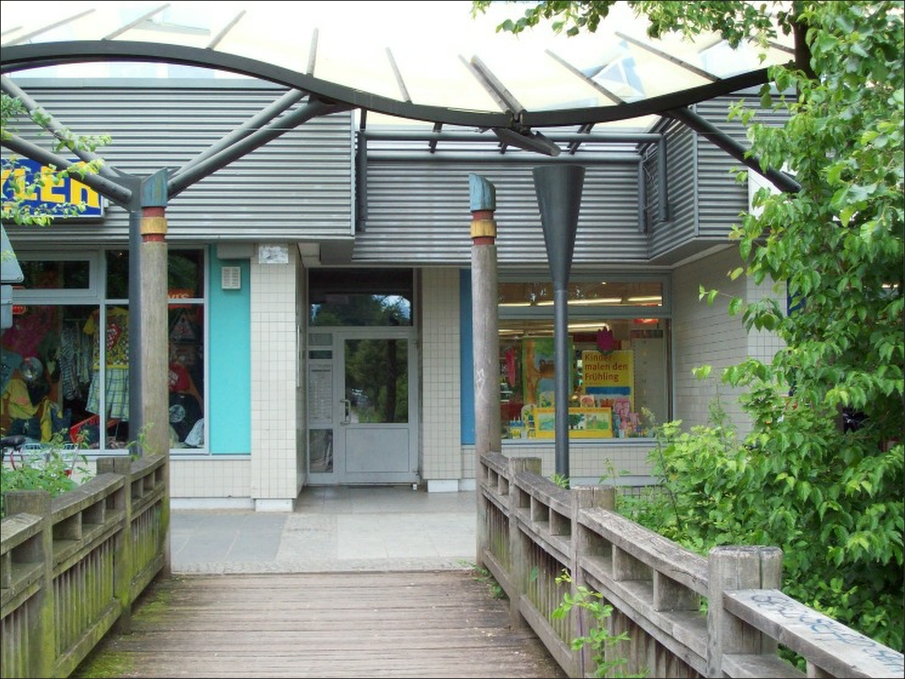

## Begegnungsstätte Warnitzer Bogen

## Offen
Mo, Mi & Do 9-17 Uhr 
Di & Fr 10-15 Uhr 
Fr 9-16 Uhr 
Sonntags-Café jeden 2. Sonntag im Monat 14 Uhr

## Angebote
Videogruppe / Künstlerisches Schaffen / Gymnastik unter fachlicher Anleitung / Line-Dance-Gruppe / Ölmalerei / Treffen der Skatfreunde u.a. Spielgruppen / Computerarbeit & Bildbearbeitung / Aquarellmalerei / kreatives Gestalten / gemischter Chor "Spätlese" / Gedächtnistraining / Chi-Kung / Seniorentanzkreis / Wandergruppe / Ernährungsberatung / Stricken für einen guten Zweck "Strickmädels" / Aktives Alter/Jahresringe /geführte Radtouren von März bis Oktober / Enkaustik-Malen mit heißem Wachs / Gymnastik.  

Die Bibliothek kann während der Öffnungszeiten zur kostenlosen Buchausleihe genutzt werden.  

## Wochenplan
<pre id="weeklyschedule">
Montag:
  09:00 Perlentechnik
  09:15 geführte Radtour (März-Oktober) 
  09:30 Gymnastik 
  10:00 Arbeiten mit Holz 
  12:00 Ölmalerei „Harmonie in Farbe“ 
  13:00 Treffen der Skatfreunde u.a. Spielgruppen
  13:00 Spielegruppe, u.a. der „Solo Club“
  17:00 Line-Dance-Gruppe / Paartanz “Silver Eagles”
  19:00 Line-Dance-Gruppe “Silver Eagles”
Dienstag:
  09:00 Tillys Zauberstube, Kreativnähen 
  09:15 2. u. 4. Di./Monat Kreatives Gestalten 
  09:30 Computerkurs 
  09:30 3. Di./Monat Seidenmalerei
  10:00 2. Di./Monat Sprechstunde der Seniorenvertretung 
  10:00 Singegruppe „Spätlese“ 
  12:15 4. Di./Monat Futtern wie bei Muttern
  13:00 Die fleißigen Stricklieseln stricken 
  13:00 Gedächtnistraining 
  13:00 1. u. 3. Di./Monat Aquarellmalerei „Dienstagsmaler“
  18.00 Uhr Line-Dance-Gruppe “Silver Eagles”
Mittwoch:
  09:00 Gymnastik 
  09:00 Computerkurs für Anfänger 
  10:00 Computerkurs 
  10:15 geselliger Tanzkreis 
  10:00 2. Mi./Monat Wandergruppe „Die Stadtbummler“ 
  14:00 2. Mi./Monat Gruppe Aktives-Alter/ Jahresringe
  14:30 Englischgespräch
  15:00 Hausmusik
  18:00 Line-Dance-Gruppe „Silver Eagles“ für Anfänger
Donnerstag:
  09:00 Arbeiten mit Holz 
  09:15 geführte Radtouren (März – Oktober) 
  09:15 1. u. 3. Do./Monat Encaustic – Malen mit Wachs
  10.00 Uhr 1. Do./Monat Kiezfrühstück/Sektfrühstück
  13.00 Uhr Treffen der Skatfreunde
Freitag:
  10:00 Computerkurs 
  10:00 Gymnastik 
  10:00 3. Fr./Monat Gesprächskreis „Miteinander-Füreinander"
  13:00 Gymnastik
  13:00 Computerkurs 
</pre>

## Links
<a target="_blank" href="https://www.vav-hhausen.de/SBS-Warnitzer-Bogen/sbst-warnitzer-start.html">Website</a>

## Zielgruppe
Menschen 50+Jahre

## Wo

 
Im Warnitzer Bogen

## Kontakt
[sbst.warnitzer@gmx.de](mailto: sbst.warnitzer@gmx.de) 
<a href="tel:++49 309290284 "> 030 9290 284</a>

