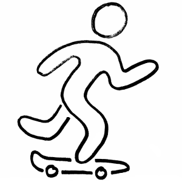
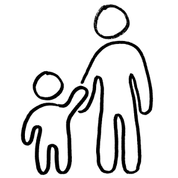
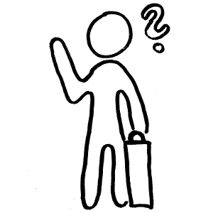
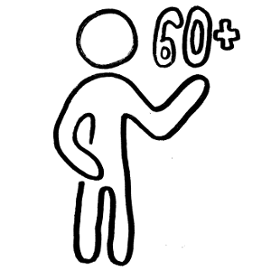

## Du bist

<label class="container">
  <input type="radio" name="radio" onclick="updateList2()" value="Jugendlicher"> Jugendliche/r
</label>
<label class="container">
  <input type="radio" name="radio" onclick="updateList2()" value="Eltern"> Mama/Papa
</label>
<label class="container">
  <input type="radio" name="radio" onclick="updateList2()" value="Neu_in_Hsh"> Neu in Hsh
</label>
<label class="container">
  <input type="radio" name="radio" onclick="updateList2()" value="Senior"> Senior/in
</label>
<label class="container">
  <input type="radio" name="radio" onclick="updateList2()" value="Startauswahl" checked="checked">  neugierig?
</label>
 

